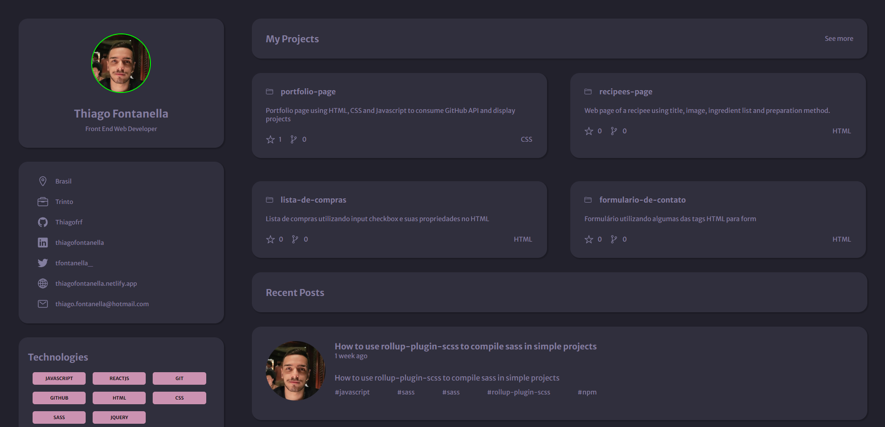

<h1 align="center"> Portfolio Page </h1>

Portfolio Page Rocketseat Challenge

  <a href="#-technologies">Technologies</a>&nbsp;&nbsp;&nbsp;|&nbsp;&nbsp;&nbsp;
  <a href="#-project">Project</a>&nbsp;&nbsp;&nbsp;|&nbsp;&nbsp;&nbsp;
  <a href="#-see-project">See Project</a>&nbsp;&nbsp;&nbsp;|&nbsp;&nbsp;&nbsp;

 

## Preview

## Layout

You can check the layout and compare with my project here: 

https://www.figma.com/file/yJcR419O5BDsStWNKGKe1L/Portfolio-%E2%80%A2-Desafio-Discover-(Copy)?node-id=0%3A1&mode=dev

## Technologies

This project was developed using the following technologies: 

- HTML
- CSS
- JS
- GitHub Pages

## Project

Portfolio page using HTML, CSS and Javascript to consume GitHub API and display projects

## See Project

See project on this link - deployed using GitHub Pages: https://thiagofrf.github.io/portfolio-page/

---

Made with ♥ by
<a href="https://linkedin.com/in/thiagofontanella">Thiago Fontanella</a>